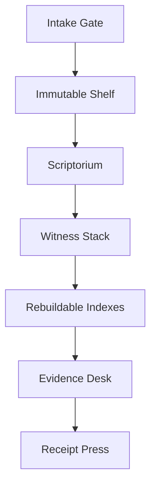

# ALEX.2

**A local-ish, provenance-first research floor for scanned books, manuscripts,
historical editions, and the claims we build from them.**

> Alexandria is not the answer. Alexandria is the floor beneath the inquiry.

ALEX.2 exists because access to old source material should not depend entirely
on plugin quotas, narrow result windows, or whichever remote service happens to
be callable today. It is designed to hold local material, enter open archives
through stable adapters, preserve competing machine and human readings, and
let every consequential claim peel backward to the exact source locus.

## Constitutional line

```text
historical object != scan
scan != transcription
transcription != normalization
normalization != translation
translation != interpretation
interpretation != claim
```

No descendant silently overwrites the layer before it.

## Selected shape

ALEX.2 begins as a **local evidence floor**:

- local PDFs, images, and text can be held under user custody;
- IIIF, Source Library, Internet Archive, and institutional collections enter
  through replaceable adapters;
- facsimiles, OCR, HTR, corrections, normalizations, and translations remain
  distinct;
- keyword, semantic, visual, and graph indexes are rebuildable projections;
- research outputs carry claim-to-page provenance and unresolved fog.

It is not initially a public library, a universal crawler, a truth engine, or a
single model trained to read every script.

## First complete loop

```text
ASK
  -> LOCATE
  -> ACQUIRE
  -> READ
  -> COMPARE
  -> CLAIM
  -> CITE
  -> RECEIPT
```

The first vertical slice will prove this loop on one locally held book. The
next gate adds one remote IIIF book before ALEX attempts collection-scale
ingestion.

## Architecture



See the [architectural blueprint](docs/superpowers/specs/2026-08-25-alexandria-floor-design.md)
for component boundaries, storage choices, refusal tests, and the first proof.

## @alex

The reusable research method lives in [`skills/alex`](skills/alex/SKILL.md).
Invoke it as **`@alex`** or **`$alex`** when research should return through
page-grounded source witnesses rather than stop at summaries or search snippets.

## Repository map

| Path | Purpose |
| --- | --- |
| `docs/superpowers/specs/` | Architectural source and design decisions |
| `docs/research-precedents.md` | Systems and standards that informed the floor |
| `skills/alex/` | Portable ALEX research skill |

## Time-addressed research spine

ALEX can resolve explicitly registered exact-SHA incubating organs from
operator/CI-supplied local materializations, verify body identity, invoke the
allowlisted JSON-stdio contract, preserve body-time receipts, and compose
FAR-SIDE -> BINOCULAR through a discovery-trigger-only bridge.

This does not make arbitrary branches executable, does not perform Git
checkout/network operations at runtime, and does not promote either incubating
organ.

## Current status

**Executable provenance/research substrate under active conformance and research work. No production service or universal truth engine is claimed.**

The original one-book floor remains architectural ancestry, but it is no longer
the implementation boundary. `main` now contains multiple bounded executable
research organs and specimens, including **CHRONOBODY-001** and **ALEX Commons +
DIALOGIC TRACE v0**. Current research is increasingly organized around
target-relative sufficiency: what information a declared question or operation
actually needs to survive a projection without silently restoring erased detail.

An owner-local BODY-EMERGENCE interface declaration is also under review as a
separate composition surface. Compatibility there would still grant no execution,
merge, evidence, truth, or adoption authority.

## Crucible runtime gate

**CRUCIBLE RUNTIME CONFORMANCE IS NOT YET CLAIMED**

Before the one-book runtime claims constitutional conformance, a real runtime
adapter must execute the applicable Crucible specimens. Contract self-tests and
fake adapters are insufficient.
