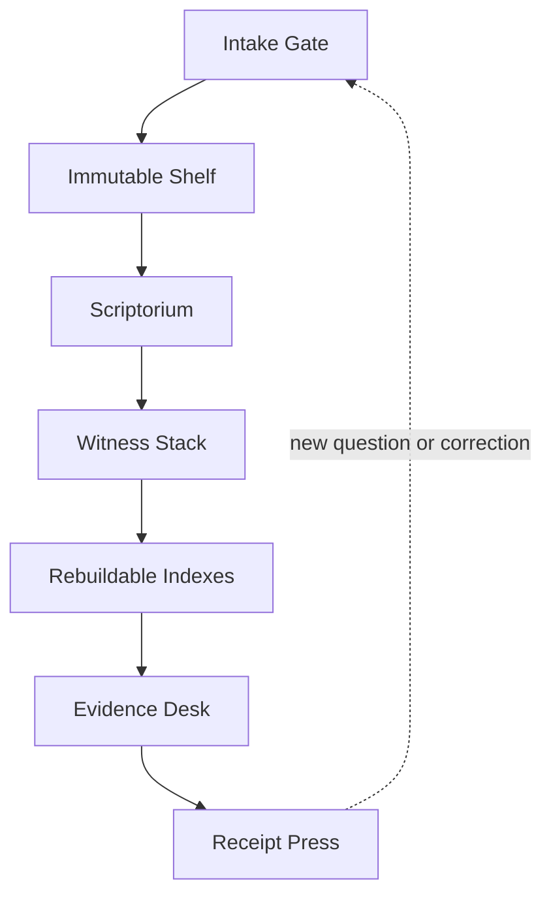
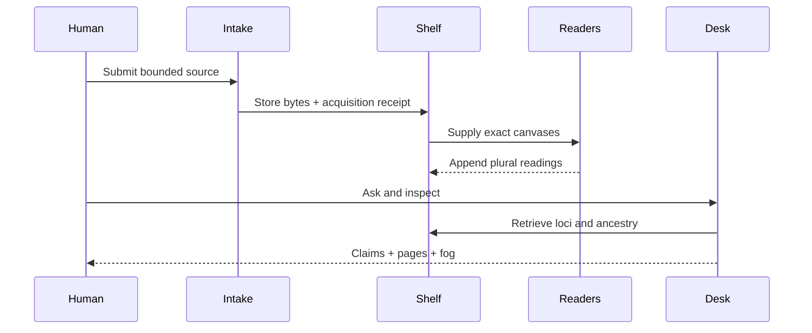

# ALEX.2 — Alexandria Floor design

**Date:** 2026-08-25

**Status:** approved architectural spine; written design awaiting human review

**Owning world:** `the-static-collective/ALEX.2`

**Skill handle:** `@alex`

**Selected approach:** local evidence floor

## Design sentence

> ALEX is a local, provenance-first research substrate that preserves source
> witnesses and every declared transformation between page and claim, while
> treating remote archives, OCR models, semantic indexes, and AI synthesis as
> replaceable adapters or projections.

## Ground and Task World Cut

The present problem is not a shortage of generic search. It is the inability to
reliably investigate large bodies of older scanned source material when plugin
quotas, narrow result windows, unstable remote access, OCR quality, and model
summaries stand between a question and the page.

Included ground:

- the approved local-floor choice;
- ALEX.2 as the new owning repository;
- Static Collective manuscript-transmission law: survival does not silently
  establish origin, completeness, identity, interpretation, canon, or
  authority;
- current public documentation for Source Library, Ithaca/Aeneas, In Codice
  Ratio, DigiVatLib, IIIF, W3C Web Annotation, TEI, Kraken, and eScriptorium.

Deliberately omitted:

- implementation in an existing Static Collective repository;
- a universal manuscript ontology;
- corpus-scale crawling;
- public multi-user publishing;
- theological, historical, or textual-canon adjudication;
- one required model provider;
- automatic Free Graph, GitBook, or external publication writes.

The cut is sufficient for a blueprint and skill. It is not sufficient to choose
production models, hosting, or final UI technology.

## Approaches considered

| Approach | Benefit | Failure pressure | Decision |
| --- | --- | --- | --- |
| Local evidence floor | Owns bytes, readings, corrections, indexes, and receipts; supports replay | Requires a real ingestion and storage vertical slice | **Selected** |
| Federated live lens | Fastest path to many collections | Retains remote caps, outages, changing APIs, and vanishing bytes | Adapter only |
| Corpus brain | Fast semantic answers and graph traversal | Collapses derived text and model similarity toward source authority | Rebuildable projection only |

## Constitutional invariants

```text
historical object != scan
scan != acquisition occurrence
scan != transcription
transcription != normalization
normalization != translation
translation != interpretation
interpretation != claim
search hit != evidence
similarity != genealogy
survival != origin or canon
custody != authority
public access != redistribution permission
```

Additional rules:

1. Raw acquisitions are immutable and content-addressed.
2. Every derived artifact names exact parents, producer, method, version, time,
   and digest.
3. Reprocessing and correction add descendants; they do not overwrite ancestry.
4. Human preference may select a reading for a purpose without deleting rivals.
5. Indexes, embeddings, graphs, summaries, and caches are rebuildable.
6. Exact quotation requires return to a resolvable page or region.
7. Printed pagination, scan sequence, and canvas identifiers remain distinct.
8. Local page bytes do not cross to an external model without recorded egress
   and user authority.
9. Missing, illegible, inaccessible, contradictory, and unresolved are valid
   states.
10. ALEX does not issue historical or interpretive authority.

## Architecture



### 1. Intake Gate

Accepts a bounded acquisition request:

- local PDF, image set, EPUB, or text;
- remote IIIF Manifest;
- supported archive item;
- page-citing corpus record such as Source Library;
- later, a user-authorized URL or collection adapter.

It records provider, locator, time, media type, rights status, access boundary,
scope, missing ranges, and a content digest. Intake may refuse unsupported,
ambiguous, restricted, oversized, or collection-scale requests.

### 2. Immutable Shelf

Holds acquired bytes and manifests in a content-addressed local store. Identical
bytes may be deduplicated without collapsing their distinct acquisition
events, catalog identities, or custody paths.

The Shelf is not the bibliographic catalog. It testifies only to held material
and its exact digest.

### 3. Scriptorium

Produces declared descendants:

- page extraction and spread splitting;
- deskewing, cropping, and layout segmentation;
- language, script, and page-type proposals;
- OCR or HTR readings;
- human corrections;
- normalizations and translations;
- page-image thumbnails and derived visual regions.

Each stage is resumable and independently versioned. A failed page does not
invalidate successful neighbors or vanish behind a book-level complete status.

### 4. Witness Stack

Maintains the inspectable relationship:

```text
work claim
  -> carrier or edition
  -> acquisition
  -> canvas
  -> region
  -> reading(s)
  -> normalization(s)
  -> translation(s)
  -> assertion(s)
```

The stack permits plural readings and editions. It stores typed relations such
as `transcribes`, `normalizes`, `translates`, `corrects`, `quotes`,
`supports`, `contradicts`, `contextualizes`, `resembles`, and
`derived_from`. It does not casually use `same_as`.

### 5. Rebuildable Indexes

The first implementation should use:

- SQLite for metadata, job state, ancestry, and transactions;
- SQLite FTS5 for exact and phrase search;
- filesystem content-addressed storage for held bytes;
- a replaceable local embedding index only after exact search and locus return
  work;
- JSON or JSON Lines export as the durable inspection and migration surface.

A graph database, distributed queue, object-storage service, and Postgres are
not required for the first proof. Their future use must answer an observed
limit.

### 6. Evidence Desk

The human research interface exposes:

- facsimile and text side by side;
- printed page, scan sequence, canvas, and region coordinates;
- selectable competing readings;
- source-language, normalized, and translated layers;
- exact, semantic, metadata, and later visual search;
- an evidence tray that collects loci without copying them into detached prose;
- claim drafting with visible support, contradiction, and unresolved status;
- correction as a new revision;
- model and egress provenance.

The Desk should use a IIIF-capable viewer such as Mirador or OpenSeadragon where
appropriate. The exact frontend framework remains deferred.

The reader-model path borrowed from narrative practice is:

```text
question
  -> current belief
  -> visible source cue
  -> possible inference
  -> confirmation, contradiction, or reframe
  -> next question
```

ALEX should help the researcher remain oriented through that transition without
turning the interface into a master narrator.

### 7. Receipt Press

Produces a bounded dossier containing:

- question and corpus cut;
- exact acquisitions and inaccessible doors;
- source layers inspected;
- claim-to-locus mappings;
- quotations and translations with edition identity;
- competing readings and counterevidence;
- rights and external-byte-egress boundaries;
- model and tool versions;
- residual fog and smallest discriminating next actions.

A receipt preserves a research encounter. It does not automatically promote its
claims into project or historical canon.

## Data flow



No step overwrites a prior occurrence. The apparent book text in the Desk is a
selected projection over the stack.

## Internal record floor

The exact schema remains an implementation decision, but v0 needs these stable
record classes:

| Record | Minimum identity |
| --- | --- |
| `work` | local ID, titles, attributed creators, dates, identifiers, claim sources |
| `carrier` | edition/object ID, publisher or collection, shelfmark, language, rights |
| `acquisition` | source locator, time, method, scope, digest, access and egress |
| `canvas` | parent acquisition, sequence, printed label, dimensions, image digest |
| `region` | canvas, selector or coordinates, purpose |
| `reading` | targeted region/canvas, producer, method/version, raw text, status |
| `transformation` | input reading, type, producer/version, output, declared loss |
| `assertion` | text, class, supporting and contradicting loci, status |
| `dossier` | question cut, assertions, receipts, fog, created time |

Use IIIF Presentation and W3C Web Annotation identifiers where they already
exist. Support later ALTO/hOCR and TEI import/export without making those
formats mandatory internal storage.

## Adapter boundaries

Adapters normalize transport, not meaning.

Each adapter returns:

- provider identity;
- remote item and page identifiers;
- raw metadata;
- available files or canvases;
- access, license, and rights testimony;
- pagination and truncation;
- fetched bytes or resolvable URLs;
- errors distinguished as empty, no match, inaccessible, malformed, rate
  limited, or service failure.

Initial candidates:

1. local filesystem and PDF;
2. generic IIIF Presentation 3;
3. Source Library API/MCP;
4. Internet Archive metadata and files;
5. local OCR/HTR engine;
6. optional external vision/translation model with explicit egress.

Only the local filesystem and PDF adapter is required for the first vertical
slice. Generic IIIF is the next independent gate.

## First vertical slice

### Inputs

- one locally held, approximately 100–300 page historical printed book;
- one research question whose answer requires inspecting several pages;
- one deliberately difficult page with columns, ornament, damage, or unusual
  orthography.

### Observable loop

1. Ingest the source with an acquisition receipt.
2. Reconstruct ordered canvases without confusing printed page and scan index.
3. Produce one baseline reading per page.
4. Produce a second independent reading for selected difficult loci.
5. Align readings while preserving disagreement.
6. Run exact and metadata search.
7. Select a result and return to its exact facsimile locus.
8. Draft one supported claim, one contradicted candidate, and one unresolved
   candidate.
9. Correct one reading as a new descendant.
10. Export a dossier and replay it offline from held bytes.

### Acceptance tests

| Test | Required result |
| --- | --- |
| Broken ancestry | Refuse an exact quotation when page or region ancestry is missing |
| Twin text | Preserve two identical text surfaces from different pages or editions as distinct witnesses |
| Rival readings | Keep both readings and their producers; do not average them |
| Correction | Append a human revision while retaining the machine reading |
| Pagination | Round-trip printed label, scan sequence, and canvas ID independently |
| Offline replay | Reopen the dossier and exact local loci without remote services |
| External egress | Record or refuse page upload to an external model |
| Rights ambiguity | Permit lawful local description while refusing unlicensed redistribution |
| Search absence | Distinguish no index match from source-level absence |
| Derived-index loss | Delete and rebuild search projections without losing source ancestry |

The vertical slice is successful only when the human can inspect the page and
the machine can refuse a broken claim.

## MADDCL0WN pressure

### The hosted corpus already exists

Source Library is close enough to invalidate “build another giant translated
library” as v0. ALEX earns existence through local custody, heterogeneous
sources, plural readings, exact ancestry, and research receipts.

### The scan can lie

A facsimile may be incomplete, color-shifted, cropped, reordered, mislabeled,
or attached to bad catalog metadata. “Direct scan” does not mean original
occurrence.

### Models may recite rather than read

Famous pages can be reproduced from training memory. Visual reading claims need
unmemorized controls, crop perturbations, or comparison with exact visible
marks when the distinction matters.

### Independent readers may share ancestry

Two AI services may use the same model family, OCR source, or training corpus.
Agreement is not independent confirmation unless lineage differs materially.

### Embeddings are anachronism engines

Semantic search can surface valuable parallels while also imposing modern
concepts and corpus-frequency biases. A parallel is a research door, not
historical dependence.

### Translation cleans the crime scene

Fluent modern English can erase ambiguity, technical vocabulary, syntax,
abbreviation, wordplay, or scribal uncertainty. Exact-form claims must return
to transcription and facsimile.

### Local can be cosmetic

If every difficult page is uploaded to a hosted model, ALEX is locally stored
but not locally processed. Egress must be visible and replaceable.

## Security, privacy, and rights

- Default local materials to no external egress.
- Keep secrets and provider tokens outside receipts and version control.
- Hash held bytes; do not publish hashes as proof of rights.
- Record licenses and rights testimony separately for work, scan, edition,
  transcription, and translation.
- Honor technical access controls and rate limits.
- Require explicit authority before bulk mirroring or publication.
- Preserve private source locators without exposing filesystem or credential
  details in public dossiers.

## Phased floor

### Phase 0 — blueprint and skill

This repository state. Human reviews the architecture and `@alex` method.

### Phase 1 — one-book proof

Implement content-addressed intake, canvases, one OCR adapter, exact search,
facsimile return, revisions, and a dossier.

### Phase 2 — two-door proof

Add generic IIIF acquisition and prove offline replay of held permitted bytes or
manifest-level return where image retention is not allowed.

### Phase 3 — difficult-reading apparatus

Add a second reader, variant alignment, human correction, uncertainty display,
and script-specific evaluation.

### Phase 4 — federation

Add Source Library and Internet Archive adapters, semantic parallels, and
cross-edition comparison without importing their authority.

### Phase 5 — collection stewardship

Only after measured need: queues, distributed storage, multi-user review,
scholarly edition export, public collaboration, or publication.

Each phase gets its own accepted plan and proof. Later-phase permissions do not
travel backward.

## Deferred decisions

The blueprint deliberately does not yet choose:

- Python versus another primary runtime;
- Mirador versus OpenSeadragon;
- OCRmyPDF, Tesseract, PaddleOCR, Kraken, or a vision model as baseline;
- embedding model or vector store;
- desktop wrapper versus localhost web app;
- Postgres, object storage, or distributed workers;
- public deployment and collaboration model.

Choose these against the first specimen, available hardware, privacy boundary,
languages, and measured failure—not prestige or plugin availability.

## Local gate

The human review gate may:

- approve the blueprint for implementation planning;
- split or narrow the first vertical slice;
- revise the constitutional stack;
- defer runtime work;
- refuse any adapter or egress boundary.

Until that gate acts, this document and the `@alex` skill are the admitted
architectural floor. They are not proof of a running research system.

## Crucible runtime gate

**CRUCIBLE RUNTIME CONFORMANCE IS NOT YET CLAIMED**

Before the one-book runtime claims constitutional conformance, a real runtime
adapter must execute the applicable Crucible specimens. Contract self-tests and
fake adapters are insufficient.

## References

See [research precedents](../../research-precedents.md) for the exact public
systems, papers, and standards that informed this design.
